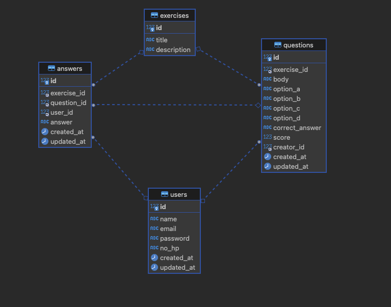

# course

## Package
- Database
    - [gorm](https://gorm.io/)
- Routing framework
    - [gin gonic](https://gin-gonic.com/)

## Dependencies
- mysql
- golang

## API Documentation
can check this  using [swagger](https://edit.swagger.io/) 

## API
- create register user
- create user login
- get exercise question
- calculate answer

## DB Schema
